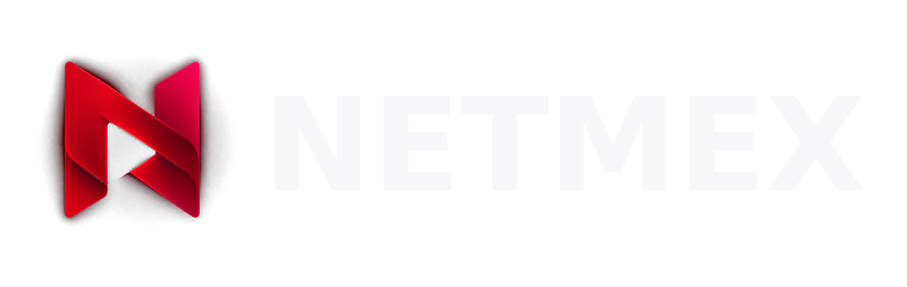

<div align="center">

  

  <p>
    A free, open-source Android media app.
    <br />
    Bring your own sources. Netmex turns them into a library with artwork, ratings, subtitles, and playback across your Android devices.
  </p>

</div>

## Build Netmex for Android

Android development requires Android Studio, JDK 17+, and the Android SDK.

```bash
git clone https://github.com/NuvioMedia/NuvioMobile.git
cd NuvioMobile
./gradlew :androidApp:assembleFullDebug
```

Use the **Full** distribution for JavaScript plugins, Cloudstream repository compatibility, P2P playback, and the complete Netmex feature set.

- Release application ID: `com.netmex.app`
- Debug application ID: `com.netmex.app.debug`
- Deep-link scheme: `netmex://`

Legacy `nuvio://` deep links remain accepted for compatibility.

## Cloudstream repositories

In **Settings → Plugins**, add a standard Cloudstream repository JSON URL. Netmex reads its `pluginLists`, verifies downloaded `.cs3` hashes, loads providers on demand, and converts their links and subtitles into Netmex streams.

Cloudstream extensions are third-party code. Only install repositories you trust and comply with applicable laws and service terms.

## Upstream and license

Netmex is based on the GPLv3-licensed [NuvioMobile](https://github.com/NuvioMedia/NuvioMobile) project.

[GNU General Public License v3.0](./LICENSE)
